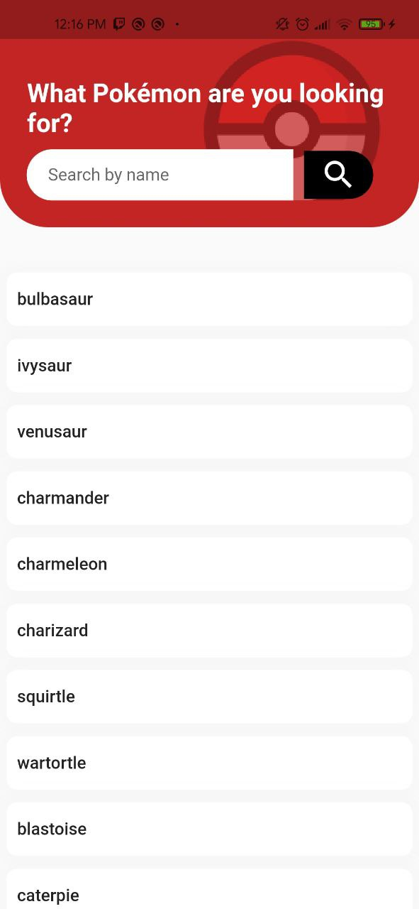

# pokeapi_flutter

<h1 align="center">
PikeApi App built with Flutter
 
</h1>

📱 Simple pokemon application build with Flutter made with clean architecture and using the official pokemon api pokeapi.co and SQFLite

## Screenshots

  
  

## Features

- :white_check_mark: Flutter, Dart
- :white_check_mark: API: https://pokeapi.co/
- :white_check_mark: SQFLite
- :white_check_mark: Clean Arquitecture
- :white_check_mark: Change Notifier Provider

## We can do

- Check list of pokemons online and offline
- Check pokemon details
- Search pokemon By name
>>>>>>> master
